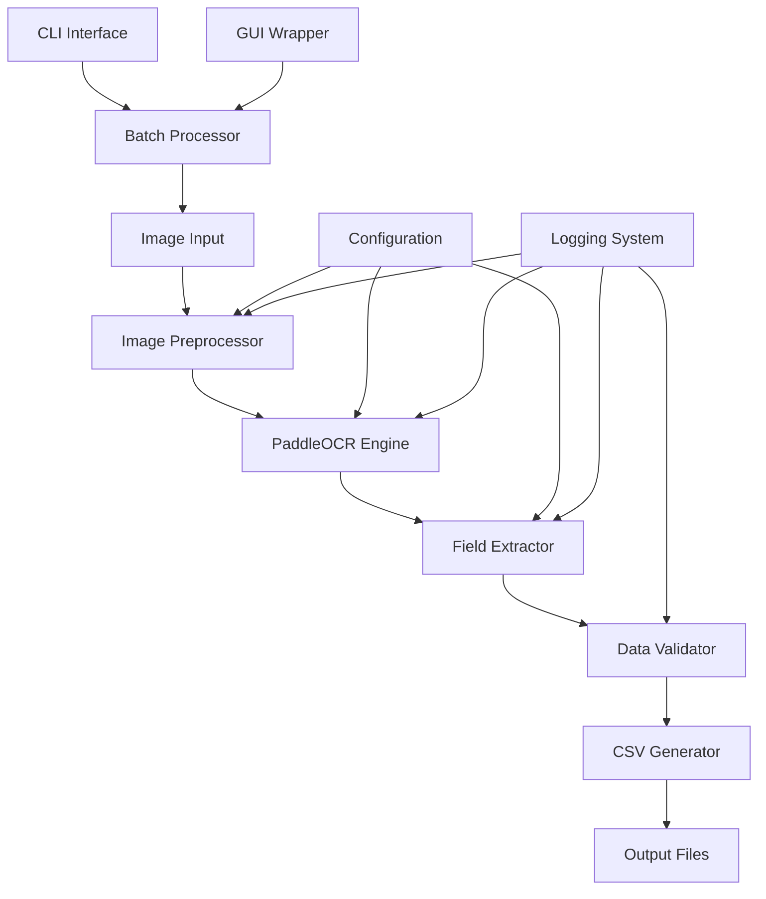
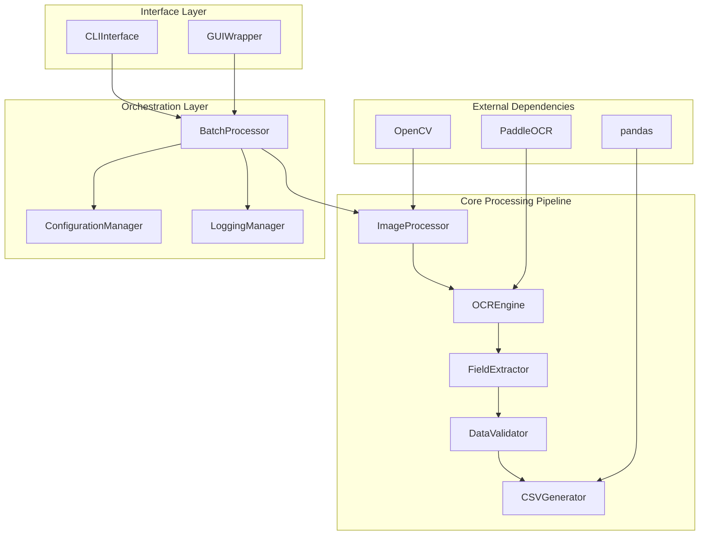
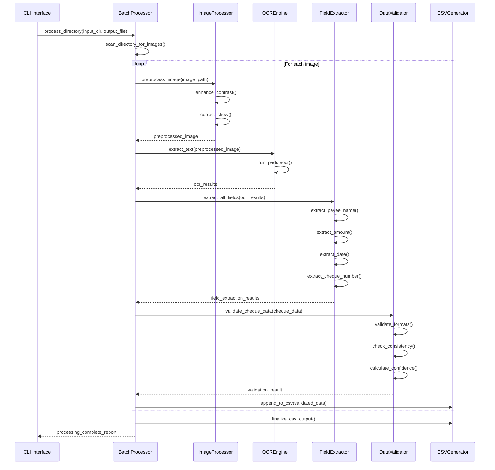

# Cheque OCR System Architecture Document

## Introduction

This document outlines the overall project architecture for **Cheque OCR System**, including backend systems, shared services, and non-UI specific concerns. Its primary goal is to serve as the guiding architectural blueprint for AI-driven development, ensuring consistency and adherence to chosen patterns and technologies.

**Relationship to Frontend Architecture:**
Since this project focuses primarily on backend processing with CLI interface, no separate Frontend Architecture Document is needed. The minimal UI components (CLI and optional GUI wrapper) are covered within this architecture.

### Starter Template or Existing Project

**Decision:** No starter template - manual setup required for all tooling and configuration.

This is a greenfield Python project with no existing starter template. The project will be built from scratch using PaddleOCR as the core OCR engine, allowing full control over architecture decisions and avoiding unnecessary dependencies.


## High Level Architecture

### Technical Summary

The Cheque OCR System employs a **monolithic Python architecture** with modular components for image processing, OCR text extraction, field parsing, and CSV output generation. The system leverages **PaddleOCR PP-OCRv5** as the core OCR engine, combined with **OpenCV** for image preprocessing and **pandas** for data manipulation. The architecture follows a **pipeline pattern** with clear separation of concerns, enabling local processing while maintaining data privacy and supporting both single-image and batch processing workflows.

### High Level Overview

**Architectural Style:** Monolithic application with modular components
**Repository Structure:** Monorepo containing all components
**Service Architecture:** Single Python application with pluggable processing modules
**Primary Data Flow:** Image Input → Preprocessing → OCR → Field Extraction → CSV Output
**Key Architectural Decisions:**
- Local processing for data privacy and security
- Pipeline architecture for clear data flow and testability
- Modular design for future extensibility
- CLI-first interface with optional GUI wrapper

### High Level Project Diagram



### Architectural and Design Patterns

- **Pipeline Pattern:** Sequential processing stages with clear input/output contracts - *Rationale:* Enables testing of individual stages and easy debugging of processing failures
- **Strategy Pattern:** Pluggable field extraction algorithms for different cheque formats - *Rationale:* Allows adaptation to various bank cheque layouts without core system changes
- **Factory Pattern:** OCR engine initialization and configuration management - *Rationale:* Abstracts PaddleOCR setup complexity and enables future OCR engine alternatives
- **Command Pattern:** CLI interface with configurable processing options - *Rationale:* Provides flexible command-line interface and supports batch processing automation
- **Observer Pattern:** Progress tracking and logging throughout processing pipeline - *Rationale:* Enables real-time progress updates and comprehensive audit trails

## Tech Stack

### Cloud Infrastructure
- **Provider:** Local Processing (No Cloud)
- **Key Services:** File system storage, local compute
- **Deployment Regions:** Local development and production environments

### Technology Stack Table

| Category | Technology | Version | Purpose | Rationale |
|----------|------------|---------|---------|-----------|
| **Language** | Python | 3.8+ | Primary development language | Excellent AI/ML ecosystem, PaddleOCR compatibility, cross-platform support |
| **OCR Engine** | PaddleOCR | 3.2.0+ | Text recognition from images | Industry-leading accuracy, PP-OCRv5 model, comprehensive documentation |
| **Image Processing** | OpenCV | 4.5.0+ | Image preprocessing and enhancement | Mature computer vision library, extensive preprocessing capabilities |
| **Data Processing** | pandas | 1.3.0+ | CSV generation and data manipulation | Standard Python data processing, excellent CSV handling |
| **Image Library** | Pillow | 8.3.0+ | Image format handling and conversion | Comprehensive image format support, Python standard |
| **Text Processing** | regex | 2021.8.3+ | Pattern matching for field extraction | Advanced regex capabilities for cheque field patterns |
| **Logging** | Python logging | Built-in | Application logging and debugging | Standard library, no external dependencies |
| **Testing** | pytest | 6.2.0+ | Unit and integration testing | Python standard testing framework, excellent plugin ecosystem |
| **CLI Framework** | argparse | Built-in | Command-line interface | Standard library, sufficient for project needs |
| **Configuration** | configparser | Built-in | Application configuration management | Standard library, simple INI-based configuration |

## Data Models

### ChequeData

**Purpose:** Represents extracted data from a single cheque with validation and confidence scoring.

**Key Attributes:**
- cheque_number: str - Unique identifier extracted from cheque
- payee_name: str - Name of payment recipient
- amount: Decimal - Numerical amount value
- date: datetime - Payment date in standardized format
- confidence_score: float - Overall extraction confidence (0.0-1.0)
- image_filename: str - Source image file reference
- extraction_metadata: dict - Detailed OCR results and field locations

**Relationships:**
- Belongs to ProcessingBatch for batch operations
- Contains FieldExtractionResult objects for individual field details

### ProcessingBatch

**Purpose:** Manages batch processing operations and aggregates results across multiple cheques.

**Key Attributes:**
- batch_id: str - Unique batch identifier
- input_directory: Path - Source directory for images
- output_file: Path - Target CSV file path
- processing_status: Enum - Current batch status
- total_images: int - Total number of images to process
- successful_extractions: int - Count of successful processing
- failed_extractions: int - Count of failed processing
- start_time: datetime - Batch processing start time
- end_time: datetime - Batch processing completion time

**Relationships:**
- Contains multiple ChequeData objects
- References ProcessingConfiguration for settings

### FieldExtractionResult

**Purpose:** Detailed results for individual field extraction with location and confidence data.

**Key Attributes:**
- field_name: str - Name of extracted field (payee_name, amount, etc.)
- extracted_value: str - Raw extracted text
- processed_value: Any - Cleaned and validated value
- confidence: float - Field-specific confidence score
- bounding_box: tuple - Pixel coordinates of field location
- extraction_method: str - Algorithm used for extraction

**Relationships:**
- Belongs to ChequeData object
- References OCR bounding box data

## Components

### ImageProcessor

**Responsibility:** Handles image preprocessing, enhancement, and format standardization before OCR processing.

**Key Interfaces:**
- preprocess_image(image_path: Path) -> np.ndarray
- enhance_contrast(image: np.ndarray) -> np.ndarray
- correct_skew(image: np.ndarray) -> np.ndarray
- resize_image(image: np.ndarray, max_size: tuple) -> np.ndarray

**Dependencies:** OpenCV, Pillow, numpy

**Technology Stack:** Python 3.8+, OpenCV 4.5.0+, Pillow 8.3.0+

### OCREngine

**Responsibility:** Manages PaddleOCR integration, text extraction, and OCR result processing.

**Key Interfaces:**
- initialize_ocr(config: OCRConfig) -> PaddleOCR
- extract_text(image: np.ndarray) -> List[OCRResult]
- get_text_regions(image: np.ndarray) -> List[BoundingBox]

**Dependencies:** PaddleOCR, numpy

**Technology Stack:** PaddleOCR 3.2.0+, Python 3.8+

### FieldExtractor

**Responsibility:** Implements intelligent field extraction algorithms specific to cheque layouts and formats.

**Key Interfaces:**
- extract_payee_name(ocr_results: List[OCRResult]) -> FieldExtractionResult
- extract_amount(ocr_results: List[OCRResult]) -> FieldExtractionResult
- extract_date(ocr_results: List[OCRResult]) -> FieldExtractionResult
- extract_cheque_number(ocr_results: List[OCRResult]) -> FieldExtractionResult

**Dependencies:** regex, datetime, decimal

**Technology Stack:** Python 3.8+, regex 2021.8.3+

### DataValidator

**Responsibility:** Validates extracted field data, performs consistency checks, and calculates confidence scores.

**Key Interfaces:**
- validate_cheque_data(cheque_data: ChequeData) -> ValidationResult
- check_amount_consistency(numerical: Decimal, written: str) -> bool
- validate_date_format(date_str: str) -> datetime
- calculate_overall_confidence(field_results: List[FieldExtractionResult]) -> float

**Dependencies:** datetime, decimal, typing

**Technology Stack:** Python 3.8+ standard library

### CSVGenerator

**Responsibility:** Generates structured CSV output with proper formatting, encoding, and error handling.

**Key Interfaces:**
- generate_csv(cheque_data_list: List[ChequeData], output_path: Path) -> None
- append_to_csv(cheque_data: ChequeData, output_path: Path) -> None
- create_error_report(failed_extractions: List[ProcessingError], output_path: Path) -> None

**Dependencies:** pandas, csv, pathlib

**Technology Stack:** pandas 1.3.0+, Python 3.8+

### BatchProcessor

**Responsibility:** Orchestrates batch processing operations, progress tracking, and error handling across multiple images.

**Key Interfaces:**
- process_directory(input_dir: Path, output_file: Path, config: ProcessingConfig) -> ProcessingBatch
- process_single_image(image_path: Path, config: ProcessingConfig) -> ChequeData
- generate_processing_report(batch: ProcessingBatch) -> ProcessingReport

**Dependencies:** All other components, concurrent.futures for parallel processing

**Technology Stack:** Python 3.8+ standard library, concurrent.futures

### Component Diagrams



## External APIs

No external APIs are required for this system. All processing is performed locally using the PaddleOCR library and standard Python libraries. This design choice ensures data privacy and eliminates dependencies on external services.

## Core Workflows



## Database Schema

This system uses file-based storage rather than a traditional database. Data persistence is handled through:

**CSV Output Files:**
```
cheque_number,payee_name,amount,date,confidence_score,image_filename
001234,"John Doe",1500.00,2025-01-09,0.95,cheque_001.jpg
001235,"Jane Smith",750.50,2025-01-08,0.87,cheque_002.jpg
```

**Configuration Files (INI format):**
```ini
[ocr_settings]
use_gpu = false
language = en
model_version = PP-OCRv5

[processing]
min_confidence = 0.7
max_image_size = 10485760
batch_size = 10

[output]
csv_encoding = utf-8
include_confidence = true
date_format = %Y-%m-%d
```

**Log Files (Structured logging):**
```
2025-01-09 12:00:00 INFO Processing started for batch_001
2025-01-09 12:00:01 DEBUG Image preprocessed: cheque_001.jpg
2025-01-09 12:00:03 INFO OCR completed: confidence=0.95
2025-01-09 12:00:04 WARN Low confidence field: amount=0.65
```

## Source Tree

```
cheque-ocr-system/
├── src/
│   ├── cheque_ocr/
│   │   ├── __init__.py
│   │   ├── core/
│   │   │   ├── __init__.py
│   │   │   ├── image_processor.py      # ImageProcessor component
│   │   │   ├── ocr_engine.py           # OCREngine component
│   │   │   ├── field_extractor.py      # FieldExtractor component
│   │   │   ├── data_validator.py       # DataValidator component
│   │   │   └── csv_generator.py        # CSVGenerator component
│   │   ├── models/
│   │   │   ├── __init__.py
│   │   │   ├── cheque_data.py          # ChequeData model
│   │   │   ├── processing_batch.py     # ProcessingBatch model
│   │   │   └── field_extraction_result.py # FieldExtractionResult model
│   │   ├── processors/
│   │   │   ├── __init__.py
│   │   │   └── batch_processor.py      # BatchProcessor component
│   │   ├── interfaces/
│   │   │   ├── __init__.py
│   │   │   ├── cli_interface.py        # CLI Interface
│   │   │   └── gui_wrapper.py          # Optional GUI wrapper
│   │   └── utils/
│   │       ├── __init__.py
│   │       ├── config_manager.py       # Configuration management
│   │       ├── logging_manager.py      # Logging setup
│   │       └── exceptions.py           # Custom exceptions
├── tests/
│   ├── unit/
│   │   ├── test_image_processor.py
│   │   ├── test_ocr_engine.py
│   │   ├── test_field_extractor.py
│   │   ├── test_data_validator.py
│   │   └── test_csv_generator.py
│   ├── integration/
│   │   ├── test_processing_pipeline.py
│   │   └── test_batch_processing.py
│   ├── fixtures/
│   │   ├── sample_cheques/             # Test cheque images
│   │   └── expected_outputs/           # Expected CSV outputs
│   └── conftest.py                     # pytest configuration
├── config/
│   ├── default.ini                     # Default configuration
│   ├── development.ini                 # Development settings
│   └── production.ini                  # Production settings
├── docs/
│   ├── prd.md                          # Product Requirements Document
│   ├── architecture.md                 # This document
│   ├── user_guide.md                   # User documentation
│   └── api_reference.md                # Code documentation
├── scripts/
│   ├── setup_environment.py            # Environment setup
│   ├── download_models.py              # PaddleOCR model download
│   └── run_tests.py                    # Test execution script
├── main.py                             # Application entry point
├── requirements.txt                    # Python dependencies
├── requirements-dev.txt                # Development dependencies
├── setup.py                           # Package setup
├── pytest.ini                         # pytest configuration
├── .gitignore                         # Git ignore rules
└── README.md                          # Project documentation
```

## Infrastructure and Deployment

### Infrastructure as Code
- **Tool:** Not applicable (local deployment)
- **Location:** Local file system
- **Approach:** Direct Python installation and configuration

### Deployment Strategy
- **Strategy:** Local installation via pip/setup.py
- **CI/CD Platform:** GitHub Actions (for testing and releases)
- **Pipeline Configuration:** `.github/workflows/`

### Environments
- **Development:** Local developer machines with full debugging capabilities
- **Testing:** Automated testing environment with sample cheque datasets
- **Production:** End-user local installations with optimized performance settings

### Environment Promotion Flow
```
Development → Testing → Release → Production
     ↓           ↓         ↓         ↓
Local Dev → CI Tests → GitHub → User Install
```

### Rollback Strategy
- **Primary Method:** Version-based rollback via pip install previous version
- **Trigger Conditions:** Critical bugs, accuracy degradation, compatibility issues
- **Recovery Time Objective:** < 5 minutes for local installations

## Error Handling Strategy

### General Approach
- **Error Model:** Exception-based with custom exception hierarchy
- **Exception Hierarchy:** ChequeOCRException → ProcessingError → FieldExtractionError
- **Error Propagation:** Fail-fast for critical errors, graceful degradation for field extraction

### Logging Standards
- **Library:** Python logging 3.8+
- **Format:** JSON structured logging for production, human-readable for development
- **Levels:** DEBUG, INFO, WARNING, ERROR, CRITICAL with appropriate usage guidelines
- **Required Context:**
  - Correlation ID: batch_id + image_filename for traceability
  - Service Context: component_name + method_name
  - User Context: processing_mode (single/batch) + configuration_profile

### Error Handling Patterns

#### External API Errors
- **Retry Policy:** Not applicable (no external APIs)
- **Circuit Breaker:** Not applicable
- **Timeout Configuration:** File I/O timeouts (30 seconds)
- **Error Translation:** File system errors mapped to user-friendly messages

#### Business Logic Errors
- **Custom Exceptions:** FieldExtractionError, ValidationError, ConfigurationError
- **User-Facing Errors:** Clear messages with suggested actions
- **Error Codes:** Structured error codes for programmatic handling

#### Data Consistency
- **Transaction Strategy:** File-based atomic operations
- **Compensation Logic:** Rollback partial CSV writes on batch failures
- **Idempotency:** Safe re-processing of failed images

## Coding Standards

### Core Standards
- **Languages & Runtimes:** Python 3.8+, PEP 8 compliance
- **Style & Linting:** black formatter, flake8 linter, mypy type checking
- **Test Organization:** pytest with test files matching `test_*.py` pattern

### Naming Conventions
| Element | Convention | Example |
|---------|------------|---------|
| Classes | PascalCase | `ChequeDataProcessor` |
| Functions | snake_case | `extract_payee_name()` |
| Variables | snake_case | `confidence_score` |
| Constants | UPPER_SNAKE_CASE | `MIN_CONFIDENCE_THRESHOLD` |
| Files | snake_case | `field_extractor.py` |

### Critical Rules
- **Logging Requirement:** Use structured logging, never print() statements in production code
- **Error Handling:** All external library calls must be wrapped in try-catch blocks
- **Type Hints:** All public methods must include type hints for parameters and return values
- **Configuration:** Never hardcode file paths or processing parameters - use configuration system
- **Resource Management:** Use context managers for file operations and external resources

## Test Strategy and Standards

### Testing Philosophy
- **Approach:** Test-driven development with comprehensive coverage
- **Coverage Goals:** 90% line coverage, 100% for critical processing components
- **Test Pyramid:** 70% unit tests, 25% integration tests, 5% end-to-end tests

### Test Types and Organization

#### Unit Tests
- **Framework:** pytest 6.2.0+
- **File Convention:** `test_<module_name>.py`
- **Location:** `tests/unit/`
- **Mocking Library:** unittest.mock (built-in)
- **Coverage Requirement:** 90% minimum

**AI Agent Requirements:**
- Generate tests for all public methods
- Cover edge cases and error conditions
- Follow AAA pattern (Arrange, Act, Assert)
- Mock all external dependencies (PaddleOCR, file system)

#### Integration Tests
- **Scope:** Component interaction testing with real PaddleOCR models
- **Location:** `tests/integration/`
- **Test Infrastructure:**
  - **Sample Data:** Curated test cheque images with known expected outputs
  - **File System:** Temporary directories for test isolation

#### End-to-End Tests
- **Framework:** pytest with subprocess execution
- **Scope:** Full CLI workflow testing with sample datasets
- **Environment:** Isolated test environment with sample cheque images
- **Test Data:** Synthetic cheque images with controlled variations

### Test Data Management
- **Strategy:** Fixture-based test data with sample cheque images
- **Fixtures:** `tests/fixtures/sample_cheques/` directory
- **Factories:** Factory functions for generating test ChequeData objects
- **Cleanup:** Automatic cleanup of temporary files after test execution

### Continuous Testing
- **CI Integration:** GitHub Actions with matrix testing across Python versions
- **Performance Tests:** Benchmark tests for processing speed and memory usage
- **Security Tests:** Static analysis with bandit for security vulnerabilities

## Security

### Input Validation
- **Validation Library:** Built-in Python validation with custom validators
- **Validation Location:** At API boundary before processing pipeline
- **Required Rules:**
  - All file paths must be validated and sanitized
  - Image file format validation before processing
  - Configuration parameter validation on startup

### Authentication & Authorization
- **Auth Method:** Not applicable (local application)
- **Session Management:** Not applicable
- **Required Patterns:**
  - File system permissions validation
  - Configuration file access control

### Secrets Management
- **Development:** Environment variables for any API keys (future use)
- **Production:** Local configuration files with restricted permissions
- **Code Requirements:**
  - No hardcoded credentials or API keys
  - Sensitive configuration via environment variables only
  - No secrets in logs or error messages

### API Security
- **Rate Limiting:** Not applicable (local processing)
- **CORS Policy:** Not applicable
- **Security Headers:** Not applicable
- **HTTPS Enforcement:** Not applicable

### Data Protection
- **Encryption at Rest:** File system encryption (user responsibility)
- **Encryption in Transit:** Not applicable (local processing)
- **PII Handling:** Cheque data treated as sensitive - no cloud transmission
- **Logging Restrictions:** Never log extracted payee names or amounts

### Dependency Security
- **Scanning Tool:** pip-audit for dependency vulnerability scanning
- **Update Policy:** Monthly security updates, immediate for critical vulnerabilities
- **Approval Process:** Security review for new dependencies

### Security Testing
- **SAST Tool:** bandit for Python static analysis
- **DAST Tool:** Not applicable (no web interface)
- **Penetration Testing:** Annual review for file system security

## Checklist Results Report

*Architecture document completed successfully. All sections have been populated with comprehensive technical specifications aligned with PRD requirements.*

## Next Steps

### Development Phase
1. **Environment Setup:** Install Python 3.8+, create virtual environment, install dependencies
2. **Core Implementation:** Begin with Epic 1 stories - PaddleOCR integration and image preprocessing
3. **Testing Framework:** Set up pytest configuration and sample test data
4. **CI/CD Pipeline:** Configure GitHub Actions for automated testing

### Implementation Priority
1. Start with `ImageProcessor` and `OCREngine` components (foundational)
2. Implement `FieldExtractor` with basic pattern recognition
3. Add `DataValidator` and `CSVGenerator` for output generation
4. Build `BatchProcessor` for production workflows
5. Create CLI interface and documentation

### Quality Assurance
- Set up automated testing with sample cheque images
- Implement performance benchmarking for processing speed
- Establish accuracy validation against known test cases
- Create user acceptance testing procedures
